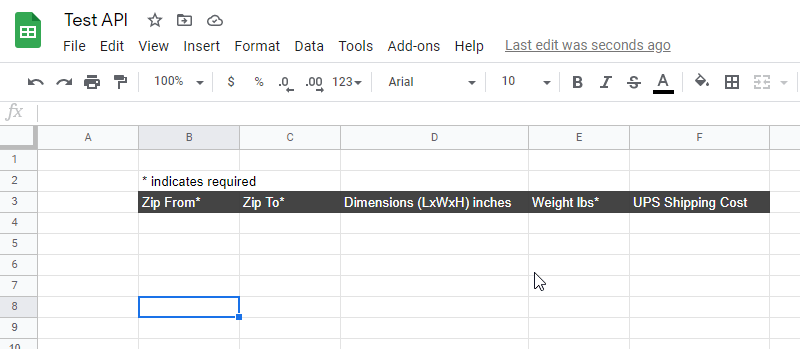

### About
This is a demo of interfacing Google Spreadsheet with UPS API (PHP) via a Google Apps Script (GAS). This should be the same output as the UPS rate calculator.

#### Example rate between two zip codes and a weight (WA to CA)

#### Example error checking per row

### How it works
On the spreadsheet you can insert a script that runs on the spreadsheet using Google Apps Script. While your spreadsheet is open you can enter the Apps Script editor by going to `Tools > Script Editor`. Then in there, there are basic "hooks" you can use eg. `onEdit` which fire when a cell is modified(move cursor off active cell). In my case I had to change to a custom `atEdit` in order to do the external API request from inside Google Apps Script.

Side note: you'll probably want to have your GAS logs open so you can see the events in real time whenever you call `Logger.log('your msg');`. Those logs are viewed by going to `View > Logs` then click the link in the popup that takes you to `Apps Script Dashboard`. This is not the same thing as plain `console.log('...');` in JS since this is running on the cloud.

The ideal way to make a Google Apps Script "professionally" would be to do it after getting oAuth permission and requesting access. Then you can insert the script I believe into the user's drive account/folder. Not sure how you associate it with a particular thing eg. spreadsheet at this time.

Anyway this was new to me so it was cool figuring it out.

### Basic error handling
The error handling checks if the minimum fields to make a UPS API call are met, particularly the zip from, zip to and weight field. The dimensions cell is technically not blank, the minimum that I found is 1 cubic inch(can't be empty). If a required cell is empty(from left to right), the alert prompt is triggered and the error cell is highlighted in red.

There is an error you can see in the second gif where the dimensions should be excluded from the trigger to validate since it's optional.

### Google Apps Script
Apparently it is possible to develop locally through an npm package but I painstakingly developed in their editor and they have this forced parenthesis/indent matching like Ruby that was kind of annoying.

### UPS API
The UPS API aspect is pretty much stock PHP from their API docs. You need your own account to use their service but the API is free surprisingly. You'll also need to enable some PHP modules eg. XML related. Other than that it's mostly making sure the fields are available, it took me a bit to figure out some missing fields in order to add the dimensions which I later found out weren't required.

There is some setup on the PHP side, namely enabling some XML php modules I think you'd call them.

#### Regarding files
The `wsdl` folder should be stock as it comes from their API examples. The `index.php` file is modified from their example as well, pretty much just added the dimensions and environment variable parsing.

### Closing
Anyway I put about 16hrs into this between figuring out how to use the UPS API and then figuring out the GAS part as I had never used GAS before. I'm also aware Zappier does this to some extent.

#### Sidenote
I developed this a different way initially with my own interface. Sadly this little app won't really see the light of day anyway but it's not much better than the public quote calculator anyway. I don't know I kind of liked the design.

